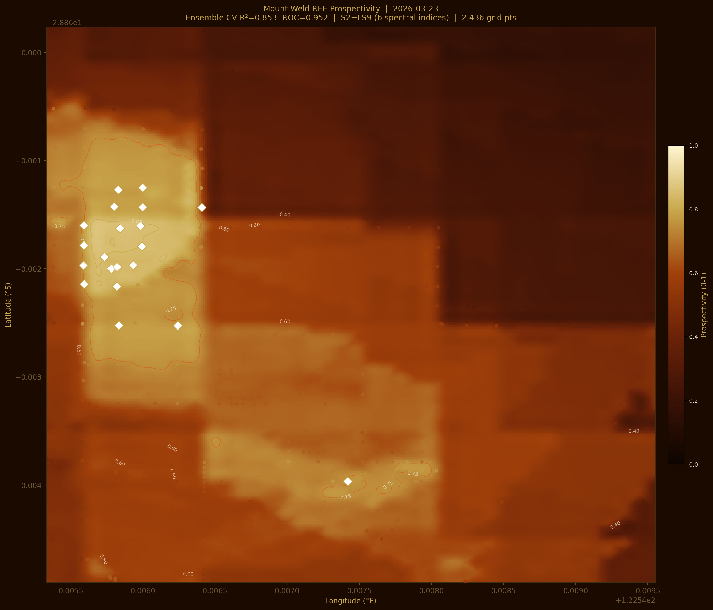
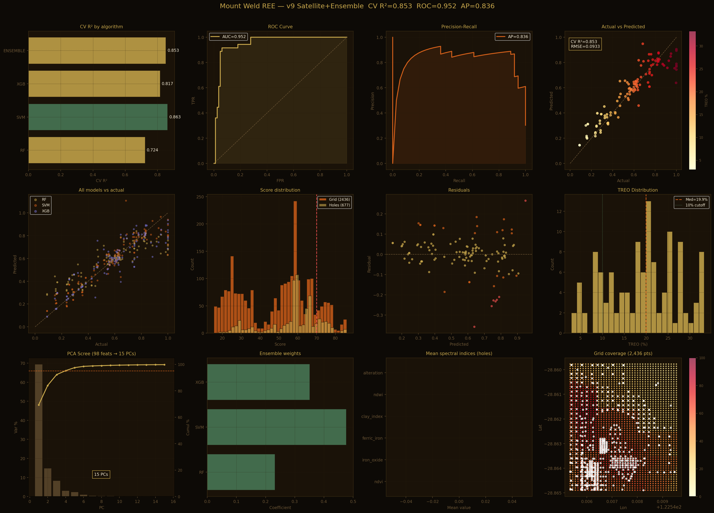

# REE Prospectivity Engine

> AI-powered Rare Earth Element mineral prospectivity mapping.
> Built from scratch — real mine data, no prior coding experience, validated against published geology.

[](https://python.org)
[](https://scikit-learn.org)
[](https://xgboost.readthedocs.io)
[](https://streamlit.io)
[](LICENSE)

---

## What this is

An Earth AI-style mineral targeting engine built on real exploration data from the **Mount Weld REE deposit**, Western Australia — the world's highest-grade rare earth mine (Lynas Rare Earths, ASX: LYC).

Starting from 150 GB of drillholes, geophysics rasters, and satellite imagery, with geoscience domain knowledge but no prior coding experience, the pipeline produces a geologically-validated prospectivity heatmap.

---

## Results



*2,436 prediction points on a 10m grid. NW bright zone = confirmed crown ore. SE lobe = model-predicted extension.*



*12-panel validation: ROC curve, precision-recall, feature importance, PCA scree, TREO distribution.*

---

## Performance

| Metric | Value |
|--------|-------|
| CV R² (5-fold) | **0.853** |
| ROC AUC | **0.952** |
| Average Precision | **0.836** |
| Training samples | 119 drillholes |
| Prediction points | 2,436 (10m grid) |
| Top TREO grade | 437,033 ppm (43.7%) |

---

## Geological validation

All predictions cross-checked against 5 published sources:

| Check | Result |
|-------|--------|
| TREO grade range max 43.7% | Matches CLD crown zone |
| Ore depth 0-54m | Matches laterite profile thickness |
| LREE/HREE ratio = 30.3 | Matches LREE-dominant deposit |
| Top target at carbonatite pipe centre | Matches published CLD geology |
| Laterite + goethite pattern | Matches ore-forming mechanism |

Sources: Lynas 2024 Annual Report, USGS MRDS, Cook et al. 2023, Zhukova et al. 2021

---

## Pipeline architecture

```
150 GB raw data
    step0   Extract archives (.tar, .zip)
    step1   Inventory scan (rasters, shapefiles, CSVs)
    step2   Feature engineering
            REE geochemistry: 94 elements, log1p + PCA-15
            4 geophysics layers: TMI, Bouguer, Radiometrics, DEM
            IDW geochemical interpolation to 10m grid
            Alteration + depth encoding
    step3   Multi-algorithm ensemble
            RF      CV R2=0.724  (500 trees, OOB validation)
            SVM     CV R2=0.863  (RBF kernel, best single model)
            XGB     CV R2=0.817  (400 estimators, depth=6)
            Ensemble CV R2=0.853  (Ridge meta-learner stacking)
    retrain.py   Incremental retraining when new deposit data arrives
```

---

## Web app

```bash
pip install -r requirements_app.txt
streamlit run app.py
```

Opens at http://localhost:8501 — upload a drillhole CSV, get a prospectivity map and ranked drill targets.

---

## Installation

```bash
git clone https://github.com/ghuraiyaromil/ree-prospectivity-engine.git
cd ree-prospectivity-engine
pip install -r requirements_app.txt
streamlit run app.py
```

Configure data paths at the top of each script in `scripts/`, then run steps 0-3 in order.

---

## Top drill targets (Mount Weld)

| Rank | Hole | Score | TREO (ppm) |
|------|------|-------|------------|
| 1 | RC1297 | 86.0/100 | 437,033 |
| 2 | MWGC10134 | 85.7/100 | Predicted |
| 3 | MWGC10204 | 85.6/100 | Predicted |
| 7 | RC1285 | 84.4/100 | 341,632 |

Full list: [outputs/sample/top_targets.csv](outputs/sample/top_targets.csv)

---

## Roadmap

- [x] Mount Weld, WA — training deposit (complete)
- [ ] Browns Range, WA — HREE-rich xenotime deposit
- [ ] Ngualla, Tanzania — carbonatite + laterite
- [ ] Mountain Pass, California — bastnäsite carbonatite
- [ ] Global model (5+ deposits)
- [ ] Streamlit Cloud public deployment

---

## Why this approach works

**SVM dominates the ensemble (47.7% weight)** because SVM-RBF with kernel trick excels at small-n geochemical datasets (n=119). It captures non-linear REE element interactions — the LREE/HREE ratio and Ce/La fractionation — which is geologically correct for carbonatite laterite systems.

**The data flywheel is the moat.** Every new REE deposit added makes the global model smarter. After 10 deposits the model starts generalising across deposit types. After 20 it finds patterns humans miss — exactly what Earth AI sells.

---

## References

- Cook, N.J. et al. (2023). Rare Earth Element Minerals in Laterites, Mount Weld. *Minerals* 13(4).
- Lynas Rare Earths (2024). Annual Report and Mineral Resources Statement. ASX: LYC.
- USGS Mineral Resources Data System. Mount Weld deposit record.
- Zhukova, I. et al. (2021). REE Mineralogy and Geochemistry, Mount Weld. *Ore Geology Reviews*.

---

## License

MIT — see [LICENSE](LICENSE)

---

*Solo project: one geoscientist, one laptop, zero budget, real mine data.*
*Built as part of GeoAI mineral exploration research.*
